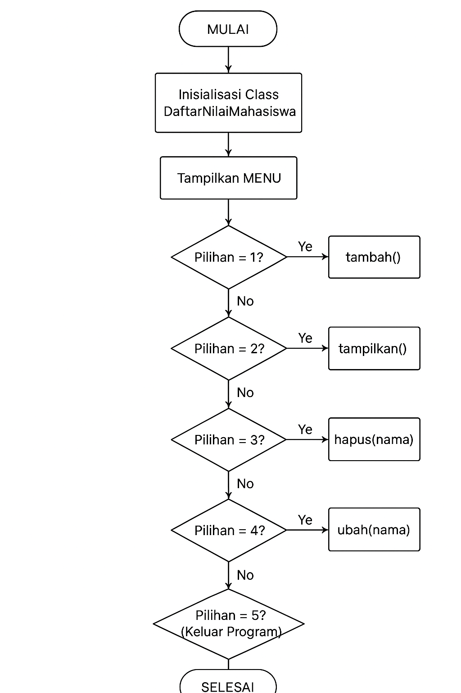
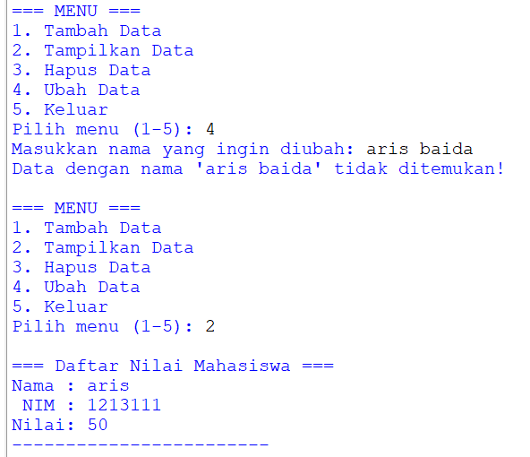

## Tugas Pengantar Pemograman 
Ini adalah tugas dari ikram ramadhan dengan dosen pengampu bapak Agung Nugroho, S.Kom., M.Kom

````shell
Nama   : Ikram Ramadhan
Nim    : 312110478
Matkul : Pengantar Pemograman
````
## code,flowchart dan output program  
````shell
class DaftarNilaiMahasiswa:
    def __init__(self):
        # Data akan disimpan dalam bentuk dictionary
        # contoh: {'Ikram': {'nim': '123', 'nilai': 90}}
        self.data = {}

    def tambah(self):
        print("\n=== Tambah Data Mahasiswa ===")
        nama = input("Nama   : ")
        nim = input("NIM    : ")
        nilai = input("Nilai  : ")

        self.data[nama] = {'nim': nim, 'nilai': nilai}
        print(f"Data '{nama}' berhasil ditambahkan!\n")

    def tampilkan(self):
        print("\n=== Daftar Nilai Mahasiswa ===")
        if not self.data:
            print("Data masih kosong!\n")
            return

        for nama, info in self.data.items():
            print(f"Nama : {nama}")
            print(f" NIM : {info['nim']}")
            print(f"Nilai: {info['nilai']}")
            print("------------------------")
        print()

    def hapus(self, nama):
        if nama in self.data:
            del self.data[nama]
            print(f"Data '{nama}' berhasil dihapus!\n")
        else:
            print(f"Data dengan nama '{nama}' tidak ditemukan!\n")

    def ubah(self, nama):
        if nama in self.data:
            print("\n=== Ubah Data Mahasiswa ===")
            nim_baru = input("NIM baru   : ")
            nilai_baru = input("Nilai baru : ")

            self.data[nama] = {'nim': nim_baru, 'nilai': nilai_baru}
            print(f"Data '{nama}' berhasil diubah!\n")
        else:
            print(f"Data dengan nama '{nama}' tidak ditemukan!\n")


# Program utama
daftar = DaftarNilaiMahasiswa()

while True:
    print("=== MENU ===")
    print("1. Tambah Data")
    print("2. Tampilkan Data")
    print("3. Hapus Data")
    print("4. Ubah Data")
    print("5. Keluar")

    pilihan = input("Pilih menu (1-5): ")

    if pilihan == "1":
        daftar.tambah()
    elif pilihan == "2":
        daftar.tampilkan()
    elif pilihan == "3":
        nama = input("Masukkan nama yang ingin dihapus: ")
        daftar.hapus(nama)
    elif pilihan == "4":
        nama = input("Masukkan nama yang ingin diubah: ")
        daftar.ubah(nama)
    elif pilihan == "5":
        print("Program selesai.")
        break
    else:
        print("Pilihan tidak valid!\n")

````
 *Flowchart program:*
  
  * *
  * *
    Hasil output program:*
    
   * *
    
   * *
    
   * *